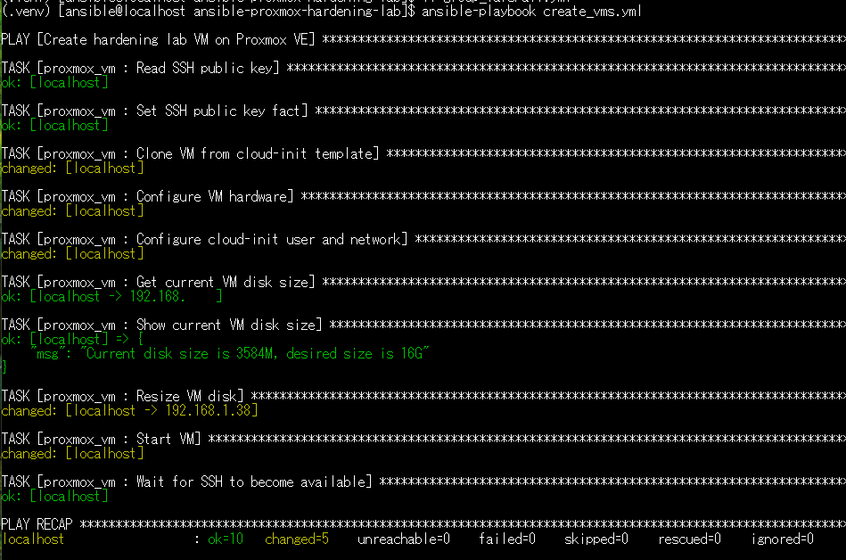
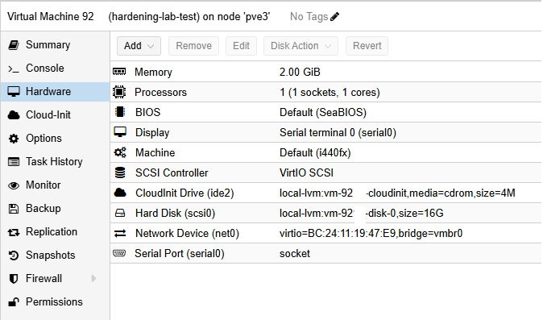
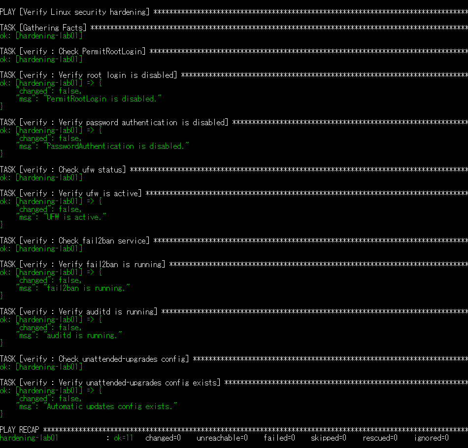
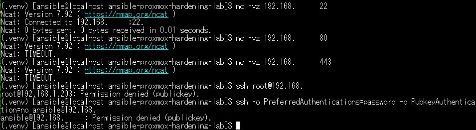

# Ansible Proxmox Linux Hardening Lab

Ansible portfolio project for provisioning a Linux VM on Proxmox VE and applying baseline security hardening.

This project automates:

- VM provisioning on Proxmox VE using the Proxmox API
- Cloud-init user, SSH key, and network configuration
- VM disk resizing through delegated `qm resize`
- SSH hardening
- UFW firewall configuration
- fail2ban setup
- auditd setup
- unattended-upgrades setup
- Verification tasks with Ansible

## Architecture

```text
Ansible Controller
  |
  | Proxmox API
  v
Proxmox VE
  |
  | Clone from Ubuntu cloud-init template
  v
Linux VM
  |
  | Ansible hardening roles
  v
Hardened Linux Server
```

## Screenshots

### VM provisioning and disk resize



### Proxmox VM hardware



### Hardening verification



### External access test



## Roles
- proxmox_vm - clone and configure a VM on Proxmox VE
- common - install common packages
- users - configure administrative user
- ssh_hardening - disable root login and password authentication
- firewall - configure UFW
- fail2ban - configure SSH brute-force protection
- auditd - enable audit logging
- automatic_updates - enable unattended upgrades
- verify - verify hardening settings

## Requirements
- Proxmox VE
- Ubuntu cloud-init template on Proxmox VE
- Ansible controller
- Python packages: proxmoxer, requests
- Ansible collections listed in requirements.yml
- SSH access from the Ansible controller to the Proxmox host for disk resizing

Install collections:

```bash
ansible-galaxy collection install -r requirements.yml -p ./collections
```

## Setup

Copy example files:

```bash
cp group_vars/all.yml.example group_vars/all.yml
cp inventory.ini.example inventory.ini
```

Edit variables:

```bash
vi group_vars/all.yml
vi inventory.ini
```

The following values must be customized:

- proxmox_api_host
- proxmox_api_user
- proxmox_api_token_id
- proxmox_api_token_secret
- proxmox_node
- template_vmid
- template_name
- hardening_vm_id
- hardening_vm_ip
- hardening_vm_gateway
- hardening_vm_dns
- cloudinit_password

## Proxmox API permissions

The Proxmox API token requires permissions for:

- VM clone and configuration
- Datastore allocation
- SDN / bridge usage
- VM power management

For lab environments, an administrator token can be used.
For production-like environments, use a dedicated API token with the minimum required permissions.

## Disk resizing

This project can resize the cloned VM disk by delegating the qm resize command to the Proxmox host over SSH.

Example variable settings:

```yaml
enable_disk_resize: true
pve_ssh_user: "root"
resize_disk_name: "scsi0"
hardening_vm_disk_size: "16G"
```

For lab environments, root SSH key authentication can be used.
For production-like environments, use a dedicated administrative SSH user with limited sudo permissions.

## Usage

Create VM:

```bash
ansible-playbook create_vms.yml
```

Check SSH connectivity:

```bash
ansible -i inventory.ini hardening_targets -m ping
```

Apply hardening:

```bash
ansible-playbook -i inventory.ini site.yml
```

Verify hardening:

```bash
ansible-playbook -i inventory.ini verify.yml
```

## Verification examples

From another Linux client:

```bash
nc -vz 192.168.56.50 22
nc -vz 192.168.56.50 80
nc -vz 192.168.56.50 443
ssh root@192.168.56.50
ssh -o PreferredAuthentications=password -o PubkeyAuthentication=no ansible@192.168.56.50
```

Expected results:

- SSH port 22 is reachable
- HTTP/HTTPS ports are blocked unless explicitly allowed
- root SSH login is denied
- password authentication is denied
- public key authentication is required

## Verified hardening items

The verify.yml playbook checks:

- PermitRootLogin is disabled
- PasswordAuthentication is disabled
- UFW is active
- fail2ban is running
- auditd is running
- unattended-upgrades configuration exists

## Security Notes

Do not commit real secrets.

The following files are intentionally ignored:

- group_vars/all.yml
- inventory.ini
- vault.yml
- .vault_pass
- SSH keys
- local Ansible collections
- virtual environments

For production environments, use trusted TLS certificates for Proxmox VE and set certificate validation accordingly.
